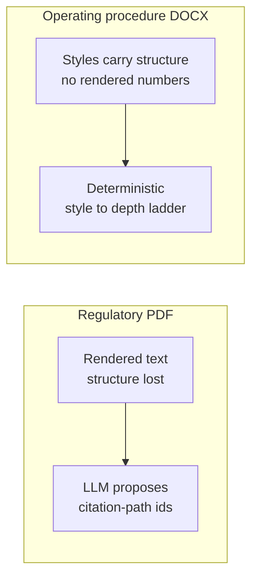
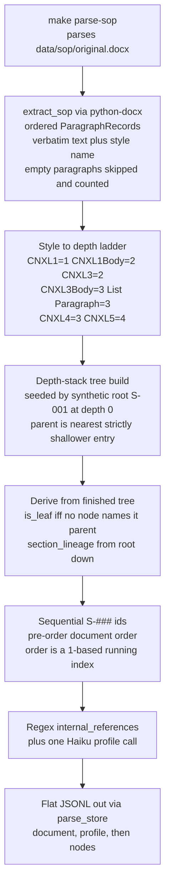
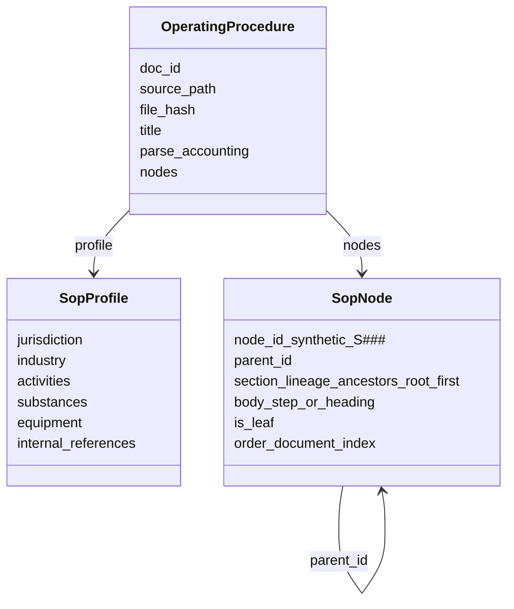
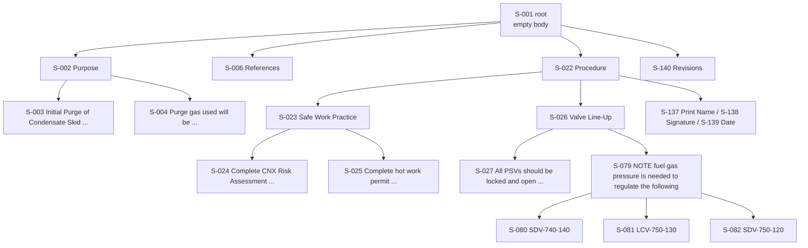

# Parsing operating procedures

How an SOP `.docx` becomes a flat JSONL tree of procedure nodes. Entry point:
`parse_operating_procedure` in `regulator/parsing.py`, fed by
`regulator/sop_extract.py`.

## Core principle

A DOCX is a **source format**, not a rendering. Its custom paragraph styles
(`CNXL1`, `CNXL3`, `CNXL4`, `CNXL5` and their `*Body` variants) already encode
the document hierarchy, so atomization is **fully deterministic**: no LLM
proposes structure, no anchors are located, nothing is sliced. The parser reads
the ordered non-empty paragraphs verbatim, maps each style to a depth, and
rebuilds the tree with a depth stack. The **only** model call in the whole stage
is one best-effort Haiku pass that fills the descriptive `SopProfile` facets —
and even that never touches the node tree.

Contrast with the regulatory (PDF) side:

| | Regulatory PDF | Operating procedure DOCX |
| --- | --- | --- |
| What the source gives you | rendered text, structure lost | structure, no rendered clause numbers |
| What is missing | machine-readable hierarchy | nothing structural — styles carry it |
| Structure comes from | an LLM proposing citation-path ids | the style→depth ladder, deterministic |
| Body text | whitespace-normalized slices between anchors | verbatim paragraph text, untouched |
| Node ids | citation paths (`5.1.3`) = public facts | `S-###` = synthetic per-run correlation keys |
| LLM calls | per-window structure passes + profile | profile only |



`S-###` ids are not citations. They are stable-per-run correlation keys assigned
in document order, meaningful only for joining verdicts back to nodes within one
parse; a regulatory `node_id` like `1910.119(f)(1)(i)` is instead a public
citation that means the same thing everywhere.

## Pipeline



Notes:
- Extraction is deterministic and lossless per paragraph. `extract_sop` returns
  each non-empty paragraph's text exactly as Word stored it, plus its style
  name; blank paragraphs are dropped and their count kept for accounting.
- The depth stack seeds a synthetic root `S-001` at depth 0. Each paragraph pops
  every stack entry at its own depth or deeper, then attaches to whatever
  remains on top — so a paragraph's parent is always the most recent paragraph
  at a strictly shallower depth.
- An **unknown** style is not fatal: it is treated as one level below the
  current node so it lands as a leaf, and warned once per style name.
- `is_leaf` is decided **after** the whole tree is built — a node is internal
  iff some other node names it as parent — never from the style alone.
- `internal_references` are extracted by a fixed set of regexes and passed
  through to the profile unchanged; the Haiku call only fills the descriptive
  facets and degrades to an empty-but-valid profile on any failure.

## Node model



Two node kinds, same split as the regulatory side:
- **Internal** node groups descendants and carries a heading or intro paragraph
  in `body`.
- **Leaf** node carries a single procedural step or clause in `body`.

`section_lineage` is the list of ancestor `node_id`s from the root down to (but
not including) the node itself. `order` is the SOP-specific 1-based document
index; the root takes `order = 1`.

### Conventions that differ from the regulatory side

| Aspect | Regulatory | Operating procedure |
| --- | --- | --- |
| Root id | `<doc_id>-root` | `S-001` |
| Root `parent_id` | the bare `doc_id` | `null` |
| Root in the order sequence | outside (synthetic, prepended) | inside — it is `order = 1`, first in the `S-###` run |
| Body text | whitespace-normalized slice | **verbatim** — tabs, double spaces, curly quotes, inch marks all preserved |
| Node ids | citation paths (public facts) | synthetic sequential `S-###` (per-run keys) |
| Lineage vs truth | compared after stripping the leading root id | compared as-is — truth lineages **include** `S-001` |

## Worked example: Majorsville — Initial Purge of Condensate Skid

The document's top-level sections (`Purpose`, `References`, `Precautions`,
`Special Equipment`, `Operator Requirements`, `Procedure`, `Revisions`) all sit
at depth 1 directly under the root. `Procedure` nests the real depth: named
sub-procedures like `Safe Work Practice` and `Valve Line-Up`, each with their
step leaves.



Two structural cases worth calling out in this tree:
- **The NOTE with children (`S-079`).** A `NOTE:` paragraph that is followed by
  more-indented sub-items becomes an **internal** node; its three bullets
  (`S-080..S-082`) attach beneath it. Because `is_leaf` is derived from the
  finished tree, `S-079` is correctly internal even though a bare `NOTE:` with
  no children elsewhere would be a leaf.
- **The signature block.** `Print Name` / `Signature` / `Date` (`S-137..S-139`)
  are step-level paragraphs, so they attach as leaves to the nearest shallower
  heading — `Procedure` (`S-022`) — rather than starting a section of their own.
  `Revisions` (`S-140`) then pops back up to a depth-1 section under the root.

Abridged JSONL from `output/sop/original.jsonl` (bodies truncated with …):

```jsonl
{"doc_id": "original", "source_path": "data/sop/original.docx", "title": "Majorsville – Initial Purge of Condensate Skid", "parse_accounting": {"pages_total": 5, "pages_parsed": 5, "warnings": ["skipped 26 empty paragraph(s) of 171 total"]}, "type": "document"}
{"jurisdiction": ["Pennsylvania"], "industry": "midstream natural gas processing", "activities": ["Initial purge of condensate skid", "..."], "internal_references": ["MJV-CGP-10", "MS-SWP-0222", "P&ID", "SPCC Plan", "..."], "type": "profile"}
{"node_id": "S-001", "parent_id": null, "section_lineage": [], "body": "", "is_leaf": false, "order": 1, "type": "node"}
{"node_id": "S-079", "parent_id": "S-026", "section_lineage": ["S-001", "S-022", "S-026"], "body": "NOTE:  Fuel gas pressure is needed to regulate the following:", "is_leaf": false, "order": 79, "type": "node"}
{"node_id": "S-080", "parent_id": "S-079", "section_lineage": ["S-001", "S-022", "S-026", "S-079"], "body": "SDV-740-140.", "is_leaf": true, "order": 80, "type": "node"}
```

> Note the verbatim body on `S-079`: the double space after `NOTE:` is preserved
> exactly, and signature-block leaves carry their literal tab runs. No
> whitespace normalization happens anywhere in this stage.

## Edge cases handled

| Situation | Handling |
| --- | --- |
| `CNXL3` double-duty — a header (e.g. `Safe Work Practice` under `Procedure`) in one place, a leaf list item elsewhere | Resolved by the **final tree**: `is_leaf` is set from whether the node ends up with children, not from the style. Same style yields internal or leaf as the shape demands. |
| `NOTE:` with more-indented sub-items | The `NOTE` becomes an **internal** node and the sub-items attach beneath it. |
| Empty paragraphs | Skipped, and the count is recorded — `warnings` carries `skipped N empty paragraph(s) of M total`. |
| Unknown paragraph style | Treated as body one level below the current node so it lands as a leaf; warned once per style name. |
| Missing / unusable API key for the profile | Profile degrades to an **empty-but-valid** `SopProfile`; the regex `internal_references` still populate, and the node tree is unaffected. |

Warnings all land in `parse_accounting.warnings` in the document header record,
alongside `pages_total` / `pages_parsed` (the DOCX page count from
`docProps/app.xml`, falling back to the paragraph total when absent).

## Running and evaluating

- Parse the SOP: `make parse-sop` — parses `data/sop/original.docx`
  (deterministic atomization; one Haiku call for the profile) into `output/sop/`.
  Clear it with `make clear DOC=sop`.
- Evaluate: `python -m regulator.evaluation` runs the YAML truth cases in
  `tests/cases/`. The SOP case (`test_parse_original.yaml`) is a **bare list**
  of node dicts — no `task`/`document` wrapper — which the harness treats as a
  **full-tree exact comparison**: node count, and every `node_id`, `parent_id`,
  `is_leaf`, `order`, `body`, and `section_lineage` must match the enumerated
  truth (146 nodes). Unlike the regulatory checks, the SOP lineage is compared
  as-is, root id included. These truth files are never edited by agents.
