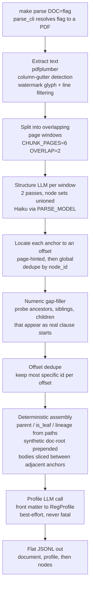
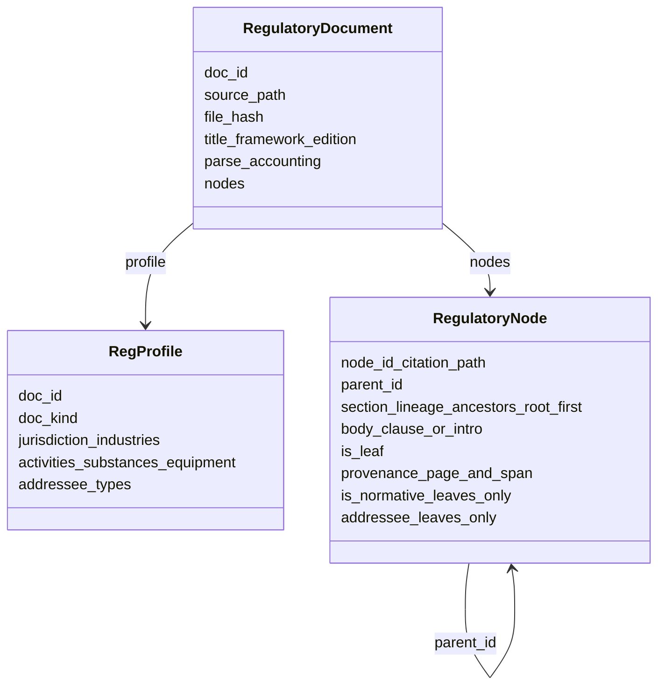
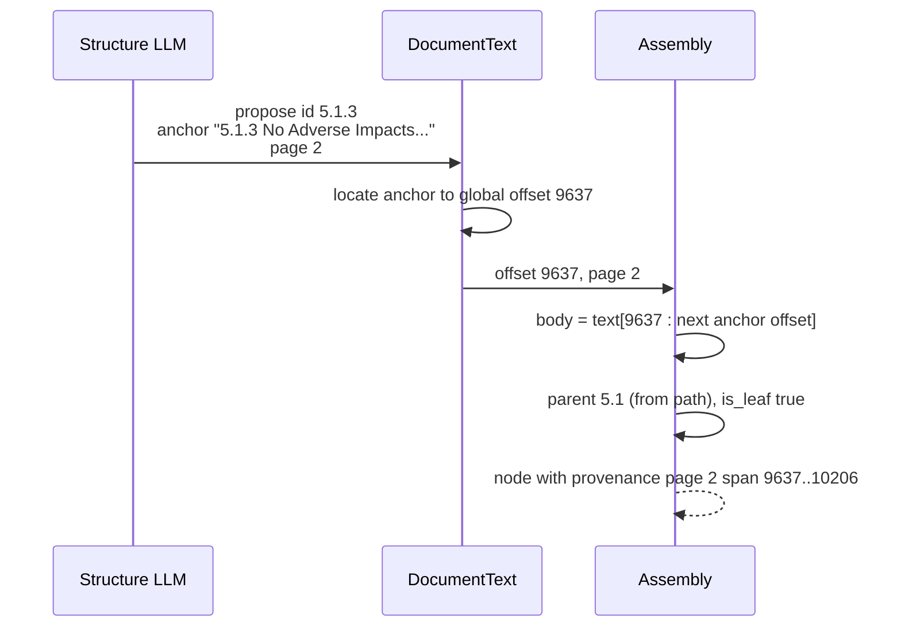

# Parsing regulatory documents

How a regulatory PDF becomes a flat JSONL tree of clause nodes. Entry point:
`parse_regulatory_document` in `regulator/parsing.py`.

## Core principle

The LLM proposes **structure only**: a set of citation-path node ids, each with
a short *verbatim* start anchor copied out of the page text. It never transcribes
or summarizes body text. Every character a node carries is sliced
**deterministically** from the PDF text extracted by `regulator/pdf_extract.py`,
between one anchor and the next. Parent links, `is_leaf`, and `section_lineage`
are then derived from the citation paths themselves, not asked of the model.

## Pipeline



Notes:
- Extraction runs first and is fully deterministic so slices are stable run to
  run. Two-column pages are split at a detected gutter and read left then right.
- Watermark noise is dropped two ways: whole banner lines by marker text, and
  individual large pink overlay glyphs *before* word assembly (so a diagonal
  watermark cannot interleave with and garble body words).
- Each window is proposed twice because Haiku under-enumerates dense clause text
  on a single pass; the union recovers most misses.
- The gap-filler is deterministic and dialect-safe: it only touches pure numeric
  ids (`6.3.1`, not `I.1.2.a`) and only adds a label that genuinely appears as a
  clause start in the extracted text.

## Node model



Two node kinds:
- **Internal** node groups descendants and carries an intro paragraph or header
  in `body`; `is_normative` / `addressee` keep their defaults.
- **Leaf** node carries a single clause; the normative facets are meaningful here.

`section_lineage` is the list of ancestor `node_id`s from the root down to (but
not including) the node itself. `is_leaf` is true iff no other node names this
one as its structural parent.

A **synthetic doc-root** is always prepended so the flat node list forms a single
tree. Its `node_id` is `<doc_id>-root`, its `parent_id` is the bare `doc_id`, its
`body` is the document title, and its `section_lineage` is empty. Every other
node's lineage begins with this root id.

## Worked example: ASTM D6400 (3 pages)

One leaf clause's journey, node `5.1.3`.



Abridged JSONL from `output/ASTM/reg-astm-d6400.jsonl` (bodies truncated with …):

```jsonl
{"doc_id": "reg-astm-d6400", "title": "Standard Specification for Labeling of Plastics...", "framework": "ASTM", "edition": "2023", "parse_accounting": {"pages_total": 3, "pages_parsed": 3, "warnings": [...]}, "type": "document"}
{"doc_id": "reg-astm-d6400", "doc_kind": "standard", "jurisdiction": ["international"], "activities": ["labeling of plastics", "aerobic composting", ...], "type": "profile"}
{"node_id": "reg-astm-d6400-root", "parent_id": "reg-astm-d6400", "section_lineage": [], "body": "Standard Specification for Labeling of Plastics...", "is_leaf": false, "provenance": {"page": 1, "span": [0, 0]}, "type": "node"}
{"node_id": "5.1.3", "parent_id": "5.1", "section_lineage": ["reg-astm-d6400-root", "5", "5.1"], "body": "5.1.3 No Adverse Impacts on Ability of Compost to Support Plant Growth—The tested materials shall not adversely impact...", "is_leaf": true, "provenance": {"page": 2, "span": [9637, 10206]}, "is_normative": false, "addressee": null, "type": "node"}
```

> Reality check: in the actual D6400 run, `5.1.3`'s verbatim anchor did **not**
> locate (its glyphs were jammed together by the watermark overlay), so the node
> was instead recovered by the **numeric gap-filler** as a sibling of the located
> `5.1.2` — same end offset, body, and provenance. Under the current design its
> warning reads `recovered by gap-filler` rather than `dropped`. Filtering the
> watermark glyphs at the character level makes the direct anchor path succeed
> more often, shrinking how much the gap-filler has to recover.

## Failure handling

| Situation | Handling |
| --- | --- |
| LLM anchor never locates, node not otherwise recovered | warning `node <id>: start anchor not found; dropped` |
| LLM anchor never locates, but gap-filler later adds the id | warning `node <id>: LLM anchor not found; recovered by gap-filler` |
| Two ids resolve to the same offset | keep most specific path; warning `duplicate of another node's anchor; dropped` |
| Numeric clause the LLM missed entirely | silently added by the gap-filler if it appears as a real clause start |
| Page yields no extractable text | warning `page <n>: no extractable text`; counted in `pages_parsed` |
| Publisher watermark / banner overlaps body | banner lines dropped by marker; large pink overlay glyphs filtered before word assembly |

Warnings describe each node's **final** fate: they are computed after the
gap-filler and offset-dedup passes run, so a node the gap-filler recovers is
never labelled `dropped`. All warnings land in
`parse_accounting.warnings` in the document header record.

## Running and evaluating

- Parse one doc: `make parse DOC=<flag>` — `<flag>` is a case-insensitive
  substring of a `data/regulations/*.pdf` name; writes JSONL to `output/<flag>/`.
  Clear it with `make clear DOC=<flag>`.
- Evaluate: `python -m regulator.evaluation` runs the YAML truth cases in
  `tests/cases/*.yaml` (e.g. `test_parse_astm_d6400.yaml`). These truth files are
  never edited by agents.
